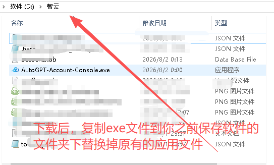

# 智云API 控制台 用户使用说明 V1.2

> 智云API 控制台是一款账号自动化注册与管理工具，支持 `DDG + IMAP` 和 `iCloud API` 两种邮箱注册方式，可在本地浏览器中完成配置、任务控制、日志查看和账号库存管理。

## 更新公告

### V1.2

- 新增两种邮箱注册方式切换：`DDG + IMAP` 和 `iCloud API`。
- 新增 iCloud 邮箱批量导入，支持一行一个邮箱账号。
- iCloud 模式会按导入顺序依次注册账号。
- 启动任务前会自动检查 iCloud 可用邮箱数量，避免注册数量超过邮箱池数量。
- 优化配置页提示：导入状态、格式错误、测试第一条 API、清空列表。
- 新版软件仍保留原有 DDG + IMAP 注册方式。

## 软件截图

### 控制台


### 账号库存


### 更新方法



## 启动软件

双击运行：

```text
AutoGPT-Account-Console.exe
```

软件启动后会自动打开管理页面。如果没有自动打开，可以在浏览器访问：

```text
http://localhost:5000
```

## 首次使用流程

1. 启动软件。
2. 如果出现授权验证窗口，先输入卡密完成验证。
3. 进入“配置向导”。
4. 选择邮箱注册方式。
5. 填好邮箱、接码和短信接码配置。
6. 回到左侧“任务控制”，填写注册数量。
7. 点击“启动任务”。
8. 在“仪表盘”查看运行日志和成功/失败数量。

## 邮箱注册方式

### 方式一：DDG + IMAP

适合使用 DuckDuckGo Email Protection 转发邮箱方式。

需要填写：

- DuckDuckGo Token
- DuckDuckGo 转发邮箱
- IMAP 服务器
- IMAP 端口
- IMAP 邮箱账号
- IMAP 授权码
- 邮件等待超时
- 轮询间隔

填写完成后可以点击“测试 IMAP”，确认邮箱能正常登录和读取。

### 方式二：iCloud API

适合你已经有一批 iCloud 邮箱，并且每个邮箱都有一个对应的接码 API 地址。

导入格式为：

```text
邮箱地址----接码API地址
```

示例：

```text
03.midsts_gifts@icloud.com----https://icloud-api.top/show/xxxx/03.midsts_gifts@icloud.com
```

可以一次粘贴多行：

```text
03.midsts_gifts@icloud.com----https://icloud-api.top/show/xxxx/03.midsts_gifts@icloud.com
04.example@icloud.com----https://icloud-api.top/show/yyyy/04.example@icloud.com
05.example@icloud.com----https://icloud-api.top/show/zzzz/05.example@icloud.com
```

操作步骤：

1. 在“邮箱注册方式”选择 `iCloud API`。
2. 把邮箱列表粘贴到导入框。
3. 点击“导入并保存”。
4. 确认下方显示已导入数量和可用数量。
5. 点击“测试第一条 API”，确认接口可以访问。
6. 设置注册数量并启动任务。

注意：iCloud 模式下，注册数量不能超过可用邮箱数量。

## HeroSMS 接码配置

如果注册过程中需要手机验证，可以启用 HeroSMS。

需要填写：

- API Key
- 代理地址，如果网络无法访问 HeroSMS，可填写代理
- 服务代码，默认 `dr`
- 国家代码
- 最高价格
- 运营商
- 短信等待超时
- 轮询间隔

推荐接码配置：

| 配置项 | 推荐值 |
| --- | --- |
| 服务代码 | `dr` |
| 国家代码 | `33` |
| 最高限价 ($) | `0.06` |
| 运营商 | `movistar - $0.0550` |
| 超时 (秒) | `120` |
| 轮询间隔 (秒) | `3` |

配置完成后可以刷新余额和实时价格。

## 账号管理

在“账号管理”页面可以：

- 查看已注册账号
- 搜索邮箱、手机号或状态
- 复制邮箱和密码
- 提取令牌
- 批量导出 JSON
- 批量导出 Session
- 删除账号
- 手动填写或修正成本

## 任务控制

左侧“任务控制”中可以设置本次注册数量。

- DDG + IMAP 模式：按填写的数量生成并注册。
- iCloud API 模式：按导入邮箱列表的顺序注册。

任务启动后可以在仪表盘查看：

- 当前步骤
- 本次成功数量
- 本次失败数量
- 库存总数
- 当前 IP 状态
- 实时运行日志

## 常见问题

### iCloud 导入后不能启动

请检查：

- 是否选择了 `iCloud API`
- 是否点击了“导入并保存”
- 每一行是否包含 `----`
- API 地址是否以 `http://` 或 `https://` 开头
- 注册数量是否超过可用邮箱数量

### 收不到验证码

请检查：

- iCloud API 是否能返回最新邮件
- 是否点击过“测试第一条 API”
- 邮件等待超时是否设置太短
- 注册页面是否真的触发了邮件验证码发送

### IMAP 测试失败

请检查：

- IMAP 服务是否已开启
- 填写的是授权码，不是邮箱登录密码
- 服务器和端口是否正确
- 网络是否能连接邮箱服务器

### 软件打开后页面没弹出

可以手动打开浏览器访问：

```text
http://localhost:5000
```

## 安全提醒

- 不要把卡密、邮箱授权码、HeroSMS API Key 发给别人。
- iCloud 接码 API 链接可以读取邮件，请当作敏感信息保存。
- 导出的账号、令牌、Session 文件都包含敏感信息，请妥善保管。

## 交流

QQ群：**832346752**

## 免责声明

本软件仅供自动化学习和研究使用。使用者需要自行遵守相关平台规则，并自行承担使用风险。

使用本软件注册或管理的账号需遵守相关平台的服务条款，请合法合规使用。

## License

MIT License
